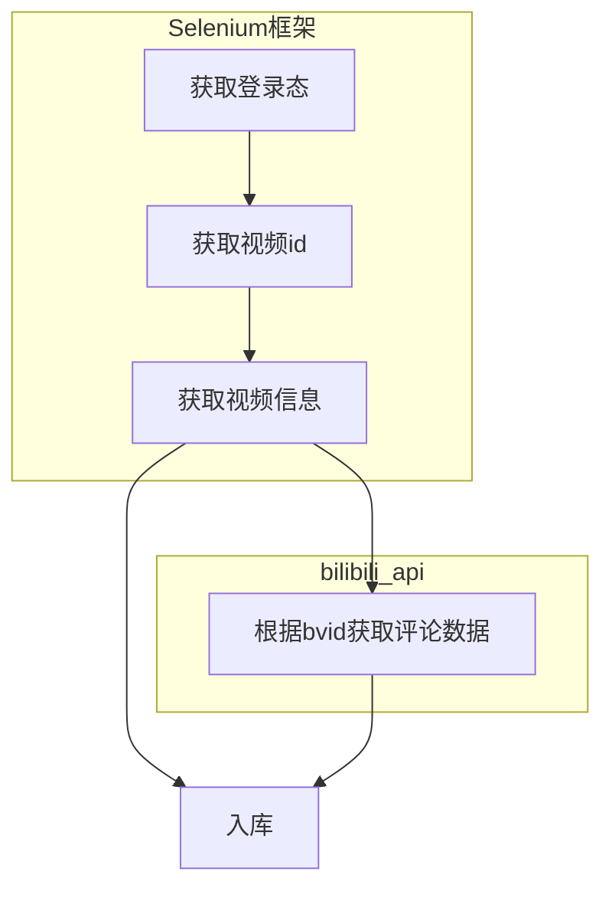
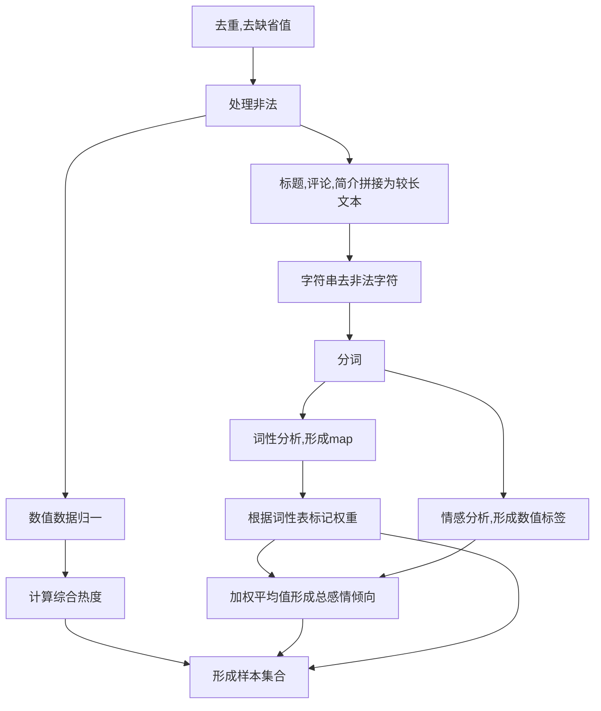
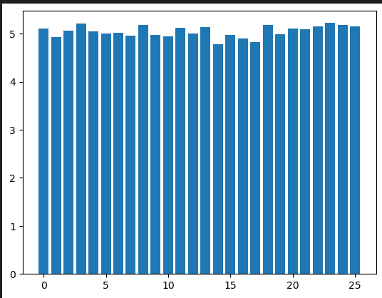

# bilibili网站视频热度与文本综合分析

# 商业理解
### （1）研究背景和意义
>研究视频网站上的视频和评论相关文本情感分析具有重要背景和意义。随着互联网的快速发展和用户生成内容的爆炸式增长，视频>网站成为人们获取信息和娱乐的主要渠道之一。通过对视频和评论中的情感进行分析，我们可以了解用户对特定主题、产品或事件>的态度和情感倾向，从而洞察他们的需求、偏好和反应。这对于视频网站提供更好的内容推荐、个性化服务以及精准广告投放具有>重要意义。此外，情感分析还可以帮助视频网站监测和管理用户评论，提供及时的用户反馈，改善用户体验和平台氛围。总之，视>频和评论相关文本情感分析的研究可以提高视频网站的运营效率和用户满意度，为用户和平台双方带来更好的体验。
### （2）国内外研究现状
>国内外对视频和评论相关文本情感分析的研究已经取得了显著进展。在国外，学者们采用机器学习和自然语言处理技术，结合情感>词典和深度学习模型，实现了对视频和评论情感的自动分类和情感极性分析。一些研究还探索了情感强度和情感变化的预测。在国>内，学者们也在视频网站数据上进行情感分析研究，使用了基于规则、词袋模型和情感词典的方法，以及基于深度学习的情感分类>模型。此外，还有研究关注评论情感对视频传播和用户行为的影响。然而，目前仍存在挑战，如多模态情感分析、用户个性化情感>建模和中文情感分析等。未来的研究应致力于解决这些问题，并进一步探索视频和评论情感分析在商业营销、用户体验和社会舆论>等领域的应用潜力。
### （3）应用前景
>视频和评论相关文本情感分析具有广阔的应用前景。首先，视频网站可以通过情感分析来改进内容推荐系统，根据用户情感倾向提>供个性化推荐，提高用户满意度和留存率。其次，情感分析可用于社交媒体舆情监测，帮助政府和企业实时了解用户对特定事件、>产品或政策的反应，从而调整决策和策略。此外，情感分析还有助于品牌管理，通过监测用户对品牌的情感反馈，企业可以及时调>整营销策略和产品改进，提升品牌形象和口碑。同时，在在线教育领域，情感分析可以帮助教师了解学生情感状态，提供个性化的>教学和支持，提高学习效果。总之，视频和评论相关文本情感分析在商业、社会和教育领域都具有广泛的应用前景，可以促进智能>决策、提升用户体验和改善社会互动。
# 数据理解
## 数据来源：
	bilibili的公共API数据及网页数据，使用selenium框架、bilibili_api获得。
## 原始数据各字段意义：
### 视频表
|字段|类型|描述|
|:---:|:--:|:--:|
|bvid  |     varchar(64)|视频的唯一标识符，由BV开头，后面跟随10个字符1。|
|aid    |     int |:视频唯一标识符，int型|            
|title         |text |       视频标题|
|pubdate | bigint |     上传时间|
|danmaku  |int|       弹幕数量|
|reply    |     int|         回复数量|
|favorite     |int|        收藏数量|
|coin       |   int|       硬币数量|
|share    |    int|        分享数量|
|like_   |       int|       点赞数量|
###评论表
|字段|类型|描述|
|:---:|:--:|:--:|    
|rpid    |bigint |评论id|
|aid     |bigint |评论的视频id|
|ctime   |bigint |上传时间|
|message |text   |评论内容|
|uname   |text   |上传者昵称|
|uid     |bigint |上传者id|
|_like   |int    |点赞数|

# 数据准备
## 数据获取

## 数据预处理

## 样本设计
#### 样本单位：每个视频样本是一个样本单位。
#### 样本容量：30000条视频，共计172万条评论，形成30000条样本。
样本存储：存于mysql中。 
包含以下数据字段：
|字段|描述|
|:--:|:--:|
|aid|视频的唯一标识符，int型。|
|text|评论、标题合并字符串|
|total_senti|该样本的总体感情倾向，取值[0,1],0表示负面情感，0.5表示中性情感，1表示正面情感。|
|sep|该样本分词结果|
|pos|该样本词性标签集|
|word_senti|视频相关文本对每个名词的情感倾向列表。|
|title|视频的标题。|
#### 保留的原始数据:
|字段|描述|
|:--:|:--:|
|play|视频的播放量|
|danmaku|视频的弹幕数|
|like|视频的点赞数|
|coin|视频的投币数|
|favorite|视频的收藏数|
|share|视频的分享数|
|reply|视频的评论数|

# 具体实现
### 数据获取
#### 1.获取登录态
```java

    /**
     * 获取登录态
     * @param driver
     * @throws Exception
     */
    public static void getlogin(WebDriver driver)throws Exception{
        File file=new File("./cookies.json");
        Gson gson=new Gson();
        if(file.exists()){
            Scanner scanner=new Scanner(file);
            while(scanner.hasNextLine()){
                String next = scanner.nextLine();
                System.out.println(next);
                Cookie cookie = gson.fromJson(next, Cookie.class);
                Cookie c=new Cookie(cookie.getName(),cookie.getValue(),cookie.getDomain(),cookie.getPath(),cookie.getExpiry());
                driver.manage().addCookie(c);
            }
        }else{
            System.out.println("empty cookies");
            new Scanner(System.in).next();
            PrintWriter writer=new PrintWriter("./cookies.json");
            Set<Cookie> cookies = driver.manage().getCookies();
            for (Cookie cookie : cookies) {
                writer.println(gson.toJson(cookie));
                writer.flush();
            }
            writer.close();
            driver.quit();System.exit(0);
        }


    }
```
#### 2.初始化内核
```java
/**
     * 初始化内核
     * @return
     * @throws Exception
     */
    public static WebDriver init()throws Exception{

        ChromeOptions options=new ChromeOptions();
        options.addArguments("--no-sandbox");
        options.addArguments("--disable-dev-shm-usage");
        options.addArguments("--headless");
        //设置驱动
        System.setProperty("webdriver.chrome.driver","chromedriver");
        //创建驱动
        WebDriver driver=new ChromeDriver(options);
        driver.get("https://www.bilibili.com");
        getlogin(driver);

        return driver;
    }
```
#### 3.获取url列表
```java
    /**
     * 获得url列表
     * @throws Exception
     */
    public static void get_urls()throws Exception{
        PrintWriter printWriter=new PrintWriter(new File("./url.txt"));
        //与将要爬取的网站建立连接
        driver.get("https://www.bilibili.com");
        int count=0;
        int errcount=0;
        WebElement next=null;
        while(count++<5) {
            try {
                next= driver.findElement(By.className("feed-roll-btn"));
                List<WebElement> list = driver.findElements(By.className("feed-card"));
                for (WebElement webElement : list) {
                    if ((webElement.findElements(By.className("bili-video-card__info--ad")).size() == 0) && webElement.findElements(By.className("bili-login-card")).size() == 0) {
                        WebElement a = webElement.findElement(By.className("bili-video-card__info--tit")).findElement(By.tagName("a"));
                        printWriter.println(a.getAttribute("href"));
                        printWriter.flush();
                    }
                }
                next.click();
                Thread.sleep((int) (Math.random() * 1000 + 500));
            }catch (NoSuchElementException e){
                Thread.sleep(10000);
                driver.quit();
                //创建驱动
                driver=new ChromeDriver();
                //与将要爬取的网站建立连接
                driver.get("https://www.bilibili.com");
                Thread.sleep(1000);
                next= driver.findElement(By.className("feed-roll-btn"));
            }
            catch (Exception e) {
                e.printStackTrace();
                errcount++;
                Thread.sleep(5000);
                if (errcount > 10) {

                    break;
                }
            }
            System.out.println("running..");
        }

    }
```
#### 4.去重
```java
class Mystr {
    String inf;

    @Override
    public boolean equals(Object o) {
        if (this == o) return true;
        if (o == null || getClass() != o.getClass()) return false;
        Mystr mystr = (Mystr) o;
        return inf.equals(mystr.inf);
    }

    public Mystr(String inf) {
        this.inf = inf;
    }

    @Override
    public int hashCode() {
        return Objects.hash(inf);
    }
}


/**
     * 去重
     * @throws Exception
     */
    public static void distinct()throws Exception{
        File file=new File("legalUrl.txt");
        File dist=new File("distinctUrl.txt");
        Scanner scanner=new Scanner(file);
        PrintWriter writer=new PrintWriter(dist);
        Set<String> rows=new HashSet<>();
        while(scanner.hasNextLine()){
            rows.add(scanner.nextLine());
        }
        for (String row : rows) {
            writer.println(row);

        }
        writer.flush();

    }
```
#### 5.处理非法
```java
    /**
     * 处理非法
     */
    public static void dealIllegal()throws Exception{
        Scanner scanner=new Scanner(new File("url.txt"));
        PrintWriter writer=new PrintWriter("legalUrl.txt");
        int count=0;
        while(scanner.hasNextLine()){
            String url=scanner.nextLine();
            if(url.indexOf("cm.bilibili.com")==-1){
                writer.println(url);
            }else{
                URL u=new URL(url);
                HttpURLConnection urlConnection = (HttpURLConnection) u.openConnection();
                InputStream inputStream = urlConnection.getInputStream();
                String ur=urlConnection.getURL().toString();
                writer.println(ur.substring(0,ur.indexOf('?')-1));
                inputStream.close();
                System.out.println(count++);
            }
            writer.flush();
        }
        scanner.close();
        writer.close();

    }

```
#### 6.截取bvid
```java
 /**
     * 截取bvid
     * @throws Exception
     */
    public static void get_bvid()throws Exception{
        File file=new File("./distinctUrl.txt");
        File out=new File("seaprate_bvid_saving/separateBvid_"+System.currentTimeMillis()+".txt");
        Scanner scanner=new Scanner(file);
        PrintWriter writer=new PrintWriter(out);
        Set<Mystr> set=new HashSet<>();
        while(scanner.hasNextLine()){
            String b=scanner.nextLine();

            b=b.substring(b.lastIndexOf('/',b.length()-1)+1,b.length());
            set.add(new Mystr(b));
        }
        scanner.close();
        for (Mystr mystr : set) {
            writer.println(mystr.inf);
        }
        scanner.close();
        writer.flush();
        writer.close();
    }
```

#### 7.获取视频信息
```java
  /**
     * new get video info
     */
    public static void getinfo(){
        try(SqlSession session=SqlTool.getCon()){
            File root=new File("seaprate_bvid_saving");
            File[] files = root.listFiles();
            for (File file : files) {
                Scanner sc=new Scanner(file);
                while(sc.hasNextLine()){
                    String avid = sc.nextLine();
                    VideoMapper mapper = session.getMapper(VideoMapper.class);
                    if(mapper.ifExist(avid)==0){
                        try {
                            HttpClient client=HttpClientBuilder.create().build();
                            HttpGet get = new HttpGet("https://api.bilibili.com/x/web-interface/view?bvid="+avid);
                            HttpResponse execute = client.execute(get);
                            Demo demo = new Gson().fromJson(new String(execute.getEntity().getContent().readAllBytes(), Charset.forName("utf-8")), Demo.class);
                            Vid vid=new Vid();
                            vid.setAid((int)demo.getData().getAid());
                            vid.setTid((int)demo.getData().getTid());
                            vid.setTitle(demo.getData().getTitle());
                            vid.setPubdate(demo.getData().getPubdate());
                            vid.setTname(demo.getData().getTname());
                            vid.setBvid(demo.getData().getBvid());
                            vid.setDanmaku((int)demo.getData().getStat().getDanmaku());
                            vid.setCoin((int)demo.getData().getStat().getCoin());
                            vid.setFavorite((int)demo.getData().getStat().getFavorite());
                            vid.setLike((int)demo.getData().getStat().getLike());
                            vid.setReply((int)demo.getData().getStat().getReply());
                            vid.setShare((int)demo.getData().getStat().getShare());
                            vid.setPic(Base64.getEncoder().encodeToString(new URL(demo.getData().getPic()).openConnection().getInputStream().readAllBytes()));
                            vid.setDesc(demo.getData().getDesc());
                            get=new HttpGet("https://api.bilibili.com/x/web-interface/view/detail/tag?bvid="+avid);
                             execute = client.execute(get);
                            String s = new String(execute.getEntity().getContent().readAllBytes(),Charset.forName("utf-8"));
                            TagAnalysis tagAnalysis = gson.fromJson(s, TagAnalysis.class);
                            Optional<String> reduce = tagAnalysis.getData().stream().map((a) -> {return a.getTagName();}).reduce((a, b) -> {return a + "</>" + b;});
                            vid.setTags(reduce.get());
//                            System.out.println(vid);
                            mapper.insertVideo(vid);
                            session.commit();
                            System.out.println(avid);
                            Thread.sleep((int)(Math.random()*500)+300);

                        }catch (PersistenceException|NullPointerException e){
                            e.printStackTrace();
                        }
                        catch (Exception e){
                            e.printStackTrace();
                            System.err.println("internet err wait for 3 minute");
                            Thread.sleep(30*1000);
                        }
                    }else{
                        System.out.println("exist");
                    }
                }
            }

        }catch (Exception e){
            e.printStackTrace();
        }

    }
```

#### 8.获取评论入库
```java
async def main():
    ccc = 0
    for id in aid:
        # 存储评论
        # 页码
        page = 1
        # 当前已获取数量
        count = 0
       
        while page<10:
            # 获取评论
            print("page=",page)
            o=0
            try:
                c = await comment.get_comments(id, comment.ResourceType.VIDEO, page,comment.OrderType.LIKE)
                time.sleep(0.3)
                if c['replies'] == None:
                    # 当前已获取数量已达到评论总数，跳出循环
                    o=1
                    break
               
                for rep in c['replies']:
                    # 存储评论
                    rpid=rep['rpid']
                    aid_=rep['oid']
                    ctime=rep['ctime']
                    message=rep['content']['message']
                    uname=rep['member']['uname']
                    uid=rep['member']['mid']
                    like_=rep['like']
                    try:
                        a=pd.read_sql_query("select count(*) found from comments where rpid="+str(id),con2)
                        if a['found'][0]!=0 :
                            print('exist')
                        else:
                            cur.execute("insert into comments values(%s,%s,%s,%s,%s,%s,%s)",(rpid,aid_,ctime,message,uname,uid,like_))
                            con2.commit()
                    except:
                        print("sql err")
                    # 增加已获取数量
                    count += len(c['replies'])
                    # 增加页码
                page += 1
            except BaseException:
                ccc+=1
                print("except,wait for 30 seconds")
                time.sleep(30)
                break
        print("aid=",id)
```
### 数据预处理
#### 1.导入数据并聚合
```python
import jieba.posseg as pseg
import pymysql
import pandas as pd
import regex as re
import numpy as np

con=pymysql.connect(host="localhost",user="root",passwd="cm2633ll",database="bilibili_spider_t")
vt_datas=pd.read_sql_query("select * from videos",con)
cm_datas=pd.read_sql_query("select aid,group_concat(message) messages from comments group by aid",con)

a=pd.merge(comments_data,videos_data[['aid','title','tid','like_','danmaku','reply','favorite','coin','share','desc_','tags']],on='aid')
labeled_datas=np.array(list(map(lambda u,x,y,z,l,q,w,e,r,t,o,p:[u,x,y,z,l,(q+w+e+r+t+o)/6,p],a['aid'],a['title'],a['desc_'],a['messages'],[i.split('</>') for i in a['tags']],a['like_'],a['danmaku'],a['reply'],a['favorite'],a['coin'],a['share'],a['tid'])))
data=labeled_datas
datas=[i for i in labeled_datas[:,1]]

```
#### 2.去除非法字符
```python
cle_datas=datas.copy()
for i in range(len(datas)):
    cle_datas[i] = re.sub("\w[\u4E00-\u9FA5]`~!@#$%^&*()_\-+=<>?:\"\{\}|,.\/;'\\[\\]·~！@#￥%……&*（）——\-+=|《》？：“”【】、；‘'，。、","",cle_datas[i])
    cle_datas[i] = re.sub("[^\u4e00-\u9fa5]","",cle_datas[i])  #  去除所有非汉字内容（英文数字）

```
#### 3.分词并标记词性
```python
weight_dict={'yg':0,'eng':0,'a':10,'ad':9,'ag':9,'an':9,'b':5,'c':0,'d':9,'df':10,'dg':8,'e':10,'f':0,'g':0,'h':0,'i':10,'j':10,'k':7,'l':7,'m':0,'mg':0,'mq':0,'n':10,'ng':10,'nr':0,'nrfg':0,'nrt':0,'ns':0,'nt':0,'nz':0,'o':7,'p':0,'q':0,'r':7,'rg':0,'rr':7,'rz':7,'s':0,'t':0,'tg':0,'u':0,'ud':0,'ug':0,'uj':0,'ul':0,'uv':0,'uz':0,'v':9,'vd':9,'vg':0,'vi':9,'vn':9,'vq':9,'x':0,'y':8,'z':8,'zg':0}

onlycorpus = []
for string in cle_datas:
    if(string == ''):
        continue
    else:
        onlycorpus.append(string)
cutcorpusiter = onlycorpus.copy()
cutcorpus = onlycorpus.copy()
cixingofword = []  # 储存分词后的词语对应的词性
wordtocixing = []  # 储存分词后的词语
for i in range(len(onlycorpus)):
    cutcorpusiter[i] = pseg.cut(onlycorpus[i])
    cutcorpus[i] = ""
    for every in cutcorpusiter[i]:   
        cutcorpus[i] = (cutcorpus[i] + " " + str(every.word)).strip()
        cixingofword.append(every.flag)
        wordtocixing.append(every.word)
# 自己造一个{“词语”:“词性”}的字典，方便后续使用词性
word2flagdict = {wordtocixing[i]:cixingofword[i] for i in range(len(wordtocixing))}

```

#### 4.提取特征
```python
from sklearn import feature_extraction  
from sklearn.feature_extraction.text import TfidfTransformer  
from sklearn.feature_extraction.text import CountVectorizer

vectorizer = CountVectorizer()
transformer = TfidfTransformer()#统计每个词语的tf-idf权值
transformer.fit_transform(vectorizer.fit_transform(cutcorpus))
#获取词袋模型中的所有词语  
word = vectorizer.get_feature_names_out()
#将tf-idf矩阵抽取出来，元素w[i][j]表示j词在i类文本中的tf-idf权重
weight = tfidf.toarray()

wordflagweight = [1 for i in range(len(word))]
for i in range(len(word)):
    wordflagweight[i] = weight_dict[word2flagdict[word[i]]]
wordflagweight = np.array(wordflagweight)
newweight = weight.copy()
for i in range(len(weight)):                
    for j in range(len(word)):
        newweight[i][j] = weight[i][j]*wordflagweight[j]

```

#### 5.DBSCAN 聚类
```python
from sklearn.cluster import DBSCAN
DBS_clf = 
(eps=1, min_samples=10)
DBS_clf.fit(newweight)
```
#####聚类结果

#### 6.SnowNLP完成情感分析
```python
# 计算每个视频的标题和评论的总体感情倾向
video_sentiments = []
count=0
for aid, messages,hot in data:
    count+=1
    cu=pseg.cut(messages)
    video_sentiment = list(map(lambda a:SnowNLP(a.word).sentiments*weight_dict[a.flag],cu))
    video_sentiment=sum(video_sentiment)/len(video_sentiment)
    video_sentiments.append({'aid': aid, 'sentiment': video_sentiment,'_like':hot})
# 转换为DataFrame进行进一步分析
video_sentiments_df = pd.DataFrame(video_sentiments)
```
#### 7.展示单个类别内的情感总倾向
```python
from functools import reduce
tids=np.array([list(i) for i in pd.DataFrame(data).groupby(3)])
# print(tids[0][1])
tids=[[i[0],pseg.cut(reduce(lambda a,b:a+b,i[1][1]))] for i in tids]
senti=[[j[0],[[SnowNLP(i.word).sentiments*weight_dict[i.flag],weight_dict[i.flag]] for i in j[1]]] for j in tids]
```
##### 单类别内情感总倾向


#### 7.完成非线性回归并可视化
```python
from sklearn.linear_model import LinearRegression as LR
from sklearn.preprocessing import PolynomialFeatures as PL
lm=LR()
pl=PL(degree=3)
reg_1=pl.fit_transform([[float(i)] for i in  video_sentiments_df['_like']])

#情感标签转换为到中心的距离平方
reg=lm.fit(X=reg_1,y=[[j] for j in [(i-5)*(i-5) for i in video_sentiments_df['sentiment']]])

# print(reg.coef_,reg.intercept_,sep=",")
x=[[i] for i in range(100000)]
y=reg.predict(pl.fit_transform(x))
plt.plot(x,y)
plt.show()
```
##### 回归结果


# 结论
可知各话题下情感倾向趋于平和，且视频综合热度与视频相关文本的总情感倾向有一定的关系，当情感倾向越强烈，播放量越低。感情趋于适中时，综合热度高。